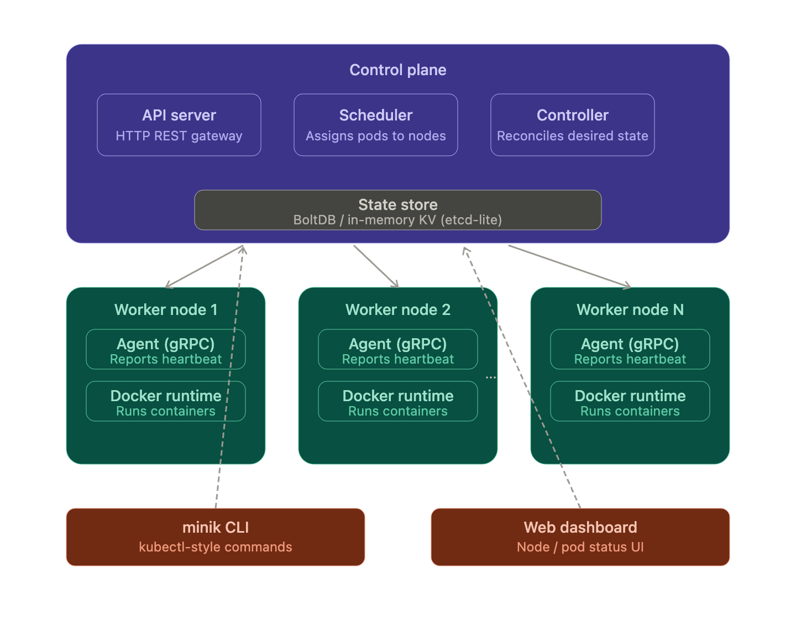

# MiniKube
MiniKube is a simplified container orchestration system inspired by [**Kubernetes**](https://kubernetes.io/docs/home/). It is designed as a learning-focused distributed systems project that demonstrates how modern container orchestration works internally.

The project includes:
- A custom control plane
- Pod scheduling
- Controller reconciliation loops
- Node heartbeats
- Container execution using Docker
- Service discovery and networking
- CLI tooling similar to kubectl

---

## Contents
1. [Technological Overview](#technological-overview)
2. [Tech Stack](#tech-stack)
3. [Folder Structure](#folder-structure)
4. [Building Phases](#building-phases)
    - [Phase 1 - Go foundations + project skeleton](#phase-1---go-foundations--project-skeleton)
    - [Phase 2 - Control plane core](#phase-2---control-plane-core)
    - [Phase 3 - Worker node and Docker container lifecycle](#phase-3---worker-node-and-docker-container-lifecycle)
    - [Phase 4 - Service Discovery and Load Balancing](#phase-4---service-discovery-and-load-balancing)

---

## Technological Overview


---

## Tech Stack

| Layer | Technology |
|---|---|
| Language | Go |
| API Server | net/http / chi |
| CLI | Cobra |
| State Store | BoltDB |
| Communication | gRPC |
| Runtime | Docker SDK |
| Dashboard | Go + React/NextJs |

---

## Folder Structure

```
MINIKUBE/
├── cmd/
│   ├── minik/
│   │   └── cmd/
│   │       ├── ping.go           # CLI ping command handler
│   │       └── root.go           # Root CLI command setup
│   ├── main.go                   # Minik entrypoint, starts CLI
│   └── server/
│       └── main.go               # Server entrypoint, starts API
├── dashboard/                    # Frontend UI assets
├── docs/
│   ├── BoltDB.md                 # BoltDB integration notes
│   └── COBRA.md                  # Cobra CLI usage docs
├── internal/
│   ├── api/
│   │   ├── handler.go            # Base HTTP handler setup
│   │   ├── node_handler.go       # Node REST endpoint handlers
│   │   ├── ping_handler.go       # Health check ping endpoint
│   │   ├── pod_handler.go        # Pod CRUD API handlers
│   │   └── service_handler.go    # Service resource API handlers
│   ├── loadbalancer/
│   │   └── loadbalancer.go       # Routes traffic across nodes
│   ├── scheduler/
│   │   └── scheduler.go          # Assigns pods to worker nodes
│   ├── store/
│   │   ├── db.go                 # BoltDB init and connection
│   │   ├── node.go               # Node state persistence layer
│   │   ├── pod.go                # Pod state persistence layer
│   │   ├── service.go            # Service data store ops
│   │   └── status.go             # Tracks resource status changes
│   └── worker/
│       └── worker.go             # Background task execution loop
├── pkg/                          # Shared library code
├── .gitignore
├── go.mod                        # Go module dependencies
├── go.sum                        # Dependency checksum lock
├── minikube.db                   # BoltDB local database file
├── overview.png                  # Architecture overview image
└── README.md                     # Project documentation
```

---

## Building Phases

### Phase 1 - Go foundations + project skeleton
- **Goal**: Get comfortable with Go patterns you'll use everywhere before touching orchestration logic.
- **What we built**: A small CLI tool and a basic HTTP server, nothing MiniKube-specific yet, just Go muscle memory.
- **Learnings**: `cobra` (CLI framework), `net/http`, JSON marshalling, and Go project layout (`cmd/`, `internal/`, `pkg/`).
- **Deliverable**: A `minik` CLI binary that can `ping` a running server and get back a response.

### Phase 2 - Control plane core
- **Goal**: Build the brain of MiniKube — the API, state store, and scheduler.
- **What we built**: A structured REST API with chi router, a BoltDB embedded state store, pod status constants, and a background scheduler that assigns pending pods to nodes.
- **Learnings**: `chi` router and method-based routing, BoltDB buckets and transactions (`db.Update`, `db.View`), goroutines and `time.NewTicker` for background loops, Go struct methods, UUID generation, and proper separation of concerns across `internal/api`, `internal/store`, and `internal/scheduler`.
- **Deliverable**: `POST /pods` creates a pod persisted in BoltDB with status `PENDING`. Within 5 seconds the scheduler picks it up, assigns it to a node round-robin, and updates its status to `SCHEDULED`. `GET /pods` reflects the live state.

### Phase 3 - Worker node and Docker container lifecycle
- **Goal**: Complete the pod lifecycle by actually running containers on worker nodes using the Docker SDK.
- **What we built**: A worker node that runs as a background goroutine, reconciles scheduled pods, pulls Docker images, creates and starts real containers, and updates pod status to `RUNNING` in the store.
- **Learnings**: Docker SDK (`ImagePull`, `ContainerCreate`, `ContainerStart`), `context.Background()` and why context is needed for long-running operations, aliasing imports to avoid naming conflicts, and chaining goroutine-based reconciliation loops.
- **Deliverable**: `POST /pods` with an image like `nginx` results in a real Docker container running on the machine within 10 seconds. `docker ps` shows the container and `GET /pods` shows status `RUNNING`.

### Phase 4 - Service Discovery and Load Balancing
- **Goal**: Allow pods to be grouped under named services and have traffic distributed across them.
- **What we built**: A `Service` data structure, service store methods on the existing `Store`, service API endpoints (`POST /services`, `GET /services`), a round-robin load balancer, and a `GET /services/{name}/next` endpoint that returns the next pod for a given service.
- **Learnings**: Chi URL parameters, separating concerns across handler files, round-robin load balancing with a per-service counter map, and why a single BoltDB connection must be shared across all store operations.
- **Deliverable**: Create a service pointing to running pods and hit `/services/{name}/next` repeatedly — each call returns the next pod in round-robin order.