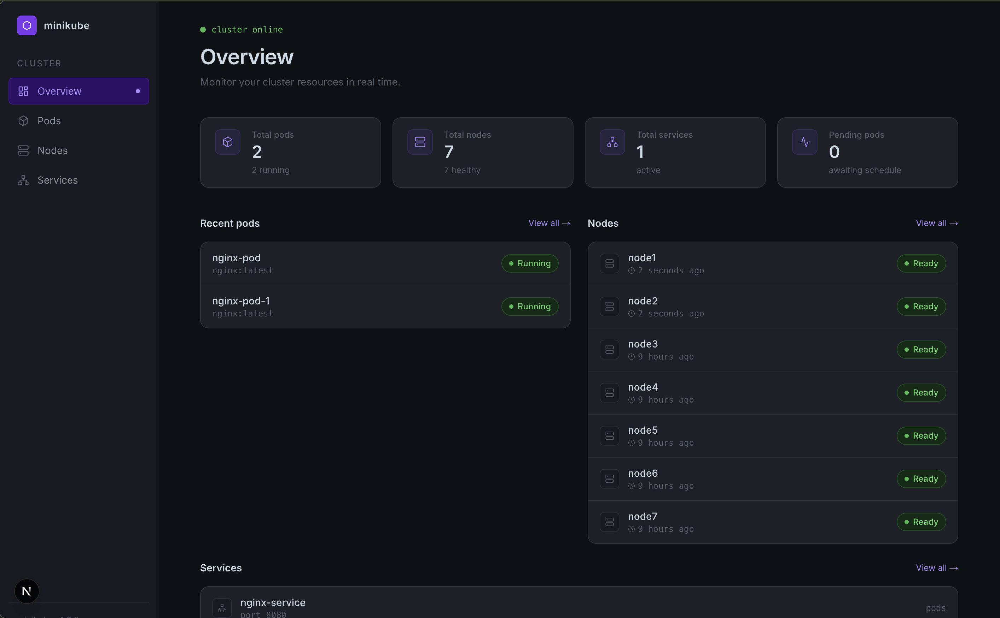

# MiniKube

> A lightweight container orchestrator built in Go, inspired by Kubernetes.

MiniKube is a distributed systems project that implements core Kubernetes concepts from scratch — pod scheduling, controller reconciliation loops, node heartbeats, container execution via Docker, service discovery, and a full CLI and web dashboard. Built as a deep dive into how modern container orchestration actually works internally.

---

## Contents

1. [Features](#features)
2. [Architecture](#architecture)
3. [Tech Stack](#tech-stack)
4. [Requirements](#requirements)
5. [Installation](#installation)
6. [Quick Start](#quick-start)
7. [CLI Reference](#cli-reference)
8. [How It Works](#how-it-works)
9. [API Reference](#api-reference)
10. [Project Structure](#project-structure)
11. [Building Phases](#building-phases)
    - [Phase 1 - Go foundations + project skeleton](#phase-1---go-foundations--project-skeleton)
    - [Phase 2 - Control plane core](#phase-2---control-plane-core)
    - [Phase 3 - Worker node and Docker container lifecycle](#phase-3---worker-node-and-docker-container-lifecycle)
    - [Phase 4 - Service Discovery and Load Balancing](#phase-4---service-discovery-and-load-balancing)
    - [Phase 5 - Multi-node support and HTTP-based worker communication](#phase-5---multi-node-support-and-http-based-worker-communication)
    - [Phase 6 - CLI commands](#phase-6---cli-commands)
    - [Phase 7 - Dashboard UI and command](#phase-7---dashboard-ui-and-command)
12. [Local Development](#local-development)

---

## Features

- **Pod scheduling** — round-robin scheduler assigns pods to healthy worker nodes automatically
- **Reconciliation loop** — controller continuously diffs desired vs actual state and self-heals
- **Real containers** — Docker SDK under the hood, actual containers are started and stopped
- **Multi-node support** — run multiple worker nodes as separate processes, each handling their own pods
- **Node failure detection** — if a worker stops sending heartbeats, it's marked `NOT_READY` and its pods are automatically rescheduled to healthy nodes
- **Pod restart policy** — if a container crashes or exits, the worker detects it and restarts it automatically
- **Multiple replicas** — specify `replicas: N` to run N containers distributed across nodes
- **Node heartbeats** — workers ping the control plane every 5 seconds; missing heartbeats trigger rescheduling
- **Service discovery** — named services route traffic across pods with round-robin load balancing
- **Log streaming** — `minik logs <pod-name>` streams live Docker container logs directly in the terminal
- **Full CLI** — `minik` CLI with `get`, `delete`, `apply`, `logs`, `describe`, `status`, `cluster`, and `dashboard` commands
- **Single file cluster config** — define your entire cluster in one `minik.yaml` and apply it with a single command
- **Web dashboard** — live Next.js dashboard showing cluster state, auto-refreshing every 5 seconds
- **Single command setup** — `minik apply -f minik.yaml` spins up the entire cluster and all resources

---

## Architecture

```
┌─────────────────────────────────────────────┐
│                Control Plane                │
│                                             │
│   ┌──────────┐  ┌───────────┐  ┌────────┐  │
│   │API Server│  │ Scheduler │  │  Store │  │
│   │ (chi)    │  │(round-rbn)│  │(BoltDB)│  │
│   └──────────┘  └───────────┘  └────────┘  │
│                 ┌────────────┐              │
│                 │ Controller │              │
│                 │(node health│              │
│                 │  watcher)  │              │
│                 └────────────┘              │
└─────────────────────────────────────────────┘
          │               │
    HTTP  │               │ HTTP
          ▼               ▼
┌──────────────┐   ┌──────────────┐
│   Worker 1   │   │   Worker 2   │
│              │   │              │
│ Docker SDK   │   │ Docker SDK   │
│ HTTP :8081   │   │ HTTP :8082   │
│ [container]  │   │ [container]  │
└──────────────┘   └──────────────┘

┌─────────────────────────────────────────────┐
│              minik CLI + Dashboard          │
│   minik apply / get / logs / status         │
│   localhost:3000 (Next.js dashboard)        │
└─────────────────────────────────────────────┘
```

The control plane runs as a single server process. Workers are separate processes that register with the control plane, receive pod assignments, execute containers via Docker, and expose their own HTTP server for log streaming. The CLI and dashboard both communicate with the control plane over HTTP.

---

## Tech Stack

| Layer | Technology |
|---|---|
| Language | Go 1.24 |
| API Server | `net/http` + `chi` router |
| CLI | Cobra |
| State Store | BoltDB (embedded key-value) |
| Container Runtime | Docker SDK for Go |
| Dashboard Frontend | Next.js + Tailwind CSS |
| UUID Generation | `github.com/google/uuid` |
| YAML Parsing | `gopkg.in/yaml.v3` |

---

## Requirements

- **Docker** — containers are run via the local Docker daemon
- **Node.js + npm** — required for the web dashboard (`minik dashboard`)

---

## Installation

```bash
curl -fsSL https://github.com/SHIVAM-KUMAR-59/minikube/raw/main/install.sh -o /tmp/install.sh
chmod +x /tmp/install.sh
/tmp/install.sh
```

This downloads the `minik`, `minik-server`, and `minik-worker` binaries for your platform and places them in `/usr/local/bin`.

Supported platforms:
- macOS arm64 (Apple Silicon)
- macOS amd64 (Intel)
- Linux amd64

---

## Quick Start

### Option A — Single file setup (recommended)

Create a `minik.yaml`:

```yaml
cluster:
  workers: 2

pods:
  - name: nginx
    image: nginx
    replicas: 2
  - name: redis
    image: redis
    replicas: 1

services:
  - name: nginx-service
    port: 80
    pods:
      - nginx-1
      - nginx-2
```

Then apply it:

```bash
minik apply -f minik.yaml
```

This starts the cluster, creates all pods and services in one shot.

### Option B — Manual setup

```bash
# 1. Start the cluster with 2 worker nodes
minik cluster start --workers 2

# 2. Create a pod from a YAML spec
minik apply -f pod.yaml

# 3. Check pod status
minik get pods

# 4. Stream logs
minik logs nginx-1

# 5. Open the web dashboard
minik dashboard

# 6. Stop everything
minik cluster stop
```

**Example `pod.yaml`:**

```yaml
name: my-nginx
image: nginx
replicas: 2
```

---

## CLI Reference

### Cluster

| Command | Description |
|---|---|
| `minik cluster start --workers N` | Start the server and N worker nodes as background processes |
| `minik cluster stop` | Stop all cluster processes |

### Resources

| Command | Description |
|---|---|
| `minik get pods` | List all pods with status and node assignment |
| `minik get nodes` | List all registered nodes with heartbeat time |
| `minik get services` | List all services |
| `minik apply -f <file>` | Apply a YAML spec — supports single pod or full minik.yaml |
| `minik logs <pod-name>` | Stream live Docker logs for a pod |
| `minik describe <pod-name>` | Show detailed information about a pod |
| `minik status` | Show overall cluster health |
| `minik delete pod <id>` | Delete a pod by ID |
| `minik delete node <id>` | Delete a node by ID |
| `minik delete service <id>` | Delete a service by ID |

### Dashboard

| Command | Description |
|---|---|
| `minik dashboard` | Start the web dashboard and open it in the browser |
| `minik ping` | Check if the server is running |

---

## How It Works

**Pod lifecycle:**

1. User runs `minik apply -f pod.yaml` — CLI sends `POST /pods` to the control plane
2. Pod is saved to BoltDB with status `PENDING`
3. Scheduler goroutine ticks every 5 seconds, finds pending pods, picks a ready node via round-robin, and marks the pod `SCHEDULED`
4. Worker goroutine on the assigned node ticks every 5 seconds, finds scheduled pods for its node, pulls the Docker image, creates and starts the container, and marks the pod `RUNNING`
5. Worker continuously inspects running containers — if a container exits, it removes it and restarts it automatically

**Node health:**

Workers send a heartbeat to `POST /nodes/{id}/heartbeat` every 5 seconds. A controller goroutine runs every 10 seconds and checks `LastHeartbeat` for every node. If a node hasn't sent a heartbeat in more than 15 seconds, it's marked `NOT_READY` and all its pods are reset to `PENDING` for rescheduling on healthy nodes.

**Log streaming:**

Each worker runs its own HTTP server (`:8081`, `:8082` etc.). When `minik logs <pod-name>` is called, the control plane looks up which node the pod is on, proxies the request to that worker's HTTP server, and streams the Docker logs back to the CLI.

**Service discovery:**

A service is a named endpoint that maps to a list of pod IDs. `GET /services/{name}/next` returns the next pod in round-robin order, enabling basic load balancing.

---

## API Reference

### Pods

| Method | Endpoint | Description |
|---|---|---|
| `POST` | `/pods` | Create a pod |
| `GET` | `/pods` | List all pods |
| `GET` | `/pods/{name}` | Get a pod by name |
| `GET` | `/pods/{id}/logs` | Stream pod logs (proxied from worker) |
| `DELETE` | `/pods/{id}` | Delete a pod |
| `PUT` | `/pods/{id}/status` | Update pod status |

### Nodes

| Method | Endpoint | Description |
|---|---|---|
| `POST` | `/nodes/register` | Register a worker node |
| `POST` | `/nodes/{id}/heartbeat` | Send a heartbeat |
| `GET` | `/nodes` | List all nodes |
| `DELETE` | `/nodes/{id}` | Delete a node |

### Services

| Method | Endpoint | Description |
|---|---|---|
| `POST` | `/services` | Create a service |
| `GET` | `/services` | List all services |
| `GET` | `/services/{name}/next` | Get next pod (load balanced) |
| `DELETE` | `/services/{id}` | Delete a service |

---

## Project Structure

```
minikube/
├── cmd/
│   ├── minik/                    ← CLI binary entry point
│   │   ├── main.go
│   │   └── cmd/
│   │       ├── root.go
│   │       ├── ping.go
│   │       ├── apply.go
│   │       ├── dashboard.go
│   │       ├── logs.go
│   │       ├── describe.go
│   │       ├── status.go
│   │       ├── get.go
│   │       ├── delete.go
│   │       ├── cluster.go
│   │       ├── get/              ← get subcommands
│   │       │   ├── pods.go
│   │       │   ├── nodes.go
│   │       │   └── services.go
│   │       ├── delete/           ← delete subcommands
│   │       │   ├── pods.go
│   │       │   ├── nodes.go
│   │       │   └── services.go
│   │       └── cluster/          ← cluster subcommands
│   │           ├── start.go
│   │           └── stop.go
│   ├── server/                   ← API server binary
│   │   └── main.go
│   └── worker/                   ← Worker node binary
│       └── main.go
├── internal/
│   ├── api/                      ← HTTP handlers
│   │   ├── handler.go
│   │   ├── pod_handler.go
│   │   ├── node_handler.go
│   │   ├── service_handler.go
│   │   └── ping_handler.go
│   ├── store/                    ← BoltDB persistence
│   │   ├── db.go
│   │   ├── pod.go
│   │   ├── node.go
│   │   ├── service.go
│   │   └── status.go
│   ├── scheduler/                ← Pod scheduling loop
│   │   └── scheduler.go
│   ├── controller/               ← Node health watcher
│   │   └── controller.go
│   ├── worker/                   ← Container execution + log server
│   │   └── worker.go
│   └── loadbalancer/             ← Round-robin load balancer
│       └── loadbalancer.go
├── dashboard/                    ← Next.js + Tailwind UI
├── docs/                         ← Learning notes
├── Makefile
├── install.sh
├── go.mod
└── README.md
```

---

## Building Phases

### Phase 1 — Go foundations + project skeleton
**Goal:** Get comfortable with Go patterns before touching orchestration logic.
**Built:** A CLI tool and basic HTTP server.
**Deliverable:** `minik ping` hits a running server and prints the response.

### Phase 2 — Control plane core
**Goal:** Build the brain — API, state store, and scheduler.
**Built:** REST API with chi, BoltDB state store, pod status constants, background scheduler with round-robin node assignment.
**Deliverable:** `POST /pods` creates a pod; within 5 seconds the scheduler assigns it to a node.

### Phase 3 — Worker node and Docker container lifecycle
**Goal:** Actually run containers on worker nodes.
**Built:** Worker goroutine that reconciles scheduled pods, pulls Docker images, creates and starts real containers.
**Deliverable:** `minik apply` results in a real Docker container running within 10 seconds.

### Phase 4 — Service discovery and load balancing
**Goal:** Allow pods to be grouped under named services with traffic distribution.
**Built:** Service data structure, store methods, API endpoints, round-robin load balancer.
**Deliverable:** `GET /services/{name}/next` returns a different pod on each call.

### Phase 5 — Multi-node support and HTTP-based worker communication
**Goal:** Separate the worker into its own binary for true distributed operation.
**Built:** Standalone `cmd/worker/main.go` with `--node-id` and `--server-url` flags, worker communicates over HTTP only — no direct DB access.
**Deliverable:** Two worker processes with different node IDs distribute pods via round-robin.

### Phase 6 — CLI commands
**Goal:** Make MiniKube usable without curl commands.
**Built:** `minik get`, `minik delete`, `minik apply -f`, `minik cluster start/stop`.
**Deliverable:** `minik cluster start --workers 2` spins up the full cluster; `minik cluster stop` tears it down.

### Phase 7 — Dashboard
**Goal:** Visual interface for cluster management.
**Built:** Next.js + Tailwind dashboard with Overview, Pods, Nodes, and Services pages. `minik dashboard` opens the browser automatically.
**Deliverable:** Live dashboard auto-refreshing every 5 seconds with create/delete actions.

### Phase 8 — Reliability and power features
**Goal:** Make the system resilient and production-like.
**Built:** Node failure detection with automatic pod rescheduling, pod restart policy, multiple replicas, `minik logs` with worker HTTP server and control plane proxy, `minik describe`, `minik status`, and full `minik.yaml` single-file cluster configuration.
**Deliverable:** `minik apply -f minik.yaml` starts the cluster and creates all resources in one command. Dead nodes trigger automatic rescheduling. Crashed containers restart automatically.

---

## Local Development

```bash
# Clone the repo
git clone https://github.com/SHIVAM-KUMAR-59/minikube.git
cd minikube

# Build all binaries
make build

# Apply a full cluster config
./minik apply -f minik.yaml

# Or run components individually
./minik-server
./minik-worker --node-id node1 --port 8081
./minik get pods
```